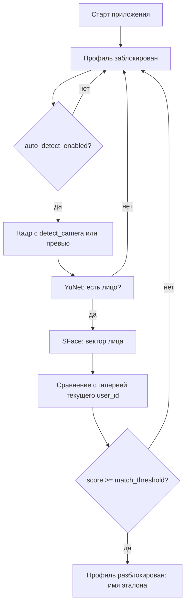

# Автономная разблокировка профиля Urblock

Документ описывает, **что должна знать** автономная подсистема и **как** по этим данным разблокировать профиль пользователя.

## Назначение

Пока пользователь не подтвердил личность лицом, **профиль заблокирован** — доступ к функциям Urblock ограничен.  
Автономный контур смотрит на **отдельную (или общую) камеру**, находит лицо, сравнивает с эталонами текущего пользователя ОС и при достаточном совпадении **разблокирует профиль** без ручного ввода пароля.

## Что система обязана знать

| Данные | Откуда | Зачем |
|--------|--------|--------|
| **ID пользователя ОС** | `getpass.getuser()` | Изоляция vault, эмбеддингов и галереи (`data/users/<логин>/`) |
| **Эталонные лица** | `data/faces.json` + снимки `data/snapshots/` | Именованные профили, добавленные вручную |
| **Биометрия пользователя** | `data/users/<логин>/biometrics/*.vault` (AES-GCM) | Автосохранённые образцы лица |
| **Векторы признаков (эмбеддинги)** | `data/embeddings/` и `data/users/<логин>/embeddings/` | Быстрое сравнение без расшифровки каждый кадр |
| **Порог совпадения** | `settings.json` → `match_threshold` (по умолчанию **0.4**) | Cosine similarity SFace: выше порога = «это вы» |
| **Камера превью** | `preview_camera_index` | Только картинка в интерфейсе |
| **Камера автономии** | `detect_camera_index` | Источник кадров для разблокировки |
| **Флаг автономии** | `auto_detect_enabled` | Вкл/выкл фоновую проверку |
| **Модели ONNX** | `models/face_detection_yunet_2023mar.onnx`, `models/face_recognition_sface_2021dec.onnx` | Детекция и извлечение признаков |

Дополнительно (безопасность хранилища):

- Соль vault: `data/users/<логин>/.vault_salt`
- Опциональный секрет: переменная окружения `URBLOCK_VAULT_KEY`

## Алгоритм разблокировки (один цикл)



1. При запуске профиль **заблокирован**.
2. Если автономия **выключена**, состояние не меняется.
3. Берётся кадр:
   - если `detect_camera_index` == `preview_camera_index` — последний кадр превью (одна камера не открывается дважды);
   - иначе — отдельный захват с `detect_camera_index`.
4. **YuNet** ищет лица; берётся самое крупное.
5. **SFace** строит эмбеддинг и сравнивает с галереей (лица + биометрия **только текущего** пользователя ОС).
6. Если лучший `score ≥ match_threshold` → профиль **разблокирован**, запоминаются имя и id эталона.
7. Иначе профиль остаётся **заблокированным**.

## Условия, без которых разблокировка невозможна

- В галерее есть хотя бы один эталон с валидным эмбеддингом.
- ONNX-модели на месте.
- Камера автономии отдаёт кадры (или совпадает с работающим превью).
- Лицо в кадре достаточно крупное и уверенно детектируется (YuNet score ≥ 0.6).

## Настройки в интерфейсе

| Настройка | Вкладка |
|-----------|---------|
| Камера для отображения | Настройки |
| Камера для автономной детекции | Настройки |
| Включить автономную детекцию | Настройки |
| Порог совпадения | `data/settings.json` (`match_threshold`) |

## Файлы на диске (пример для пользователя `ububu`)

```
data/
  faces.json                 # список имён (ручные лица)
  snapshots/<id>.jpg
  settings.json
  users/ububu/
    biometrics/<uuid>.vault  # зашифрованная биометрия
    embeddings/<uuid>.npy    # векторы биометрии
  embeddings/<id>.npy        # векторы ручных лиц
```

## Ограничения текущей версии

- Разблокировка действует **до перезапуска** приложения (повторная блокировка по таймауту — отдельная доработка).
- Сравнение только с эталонами **текущего** пользователя ОС.
- Автосохранение новой биометрии в vault при незнакомом лице (`auto_biometrics`) в UI пока не подключено к автономному контуру.

## Связь с кодом

- Спецификация в коде: `autonomous/knowledge.py`
- Состояние профиля: `app_profile/session.py`
- Фоновая проверка: `autonomous/service.py`
